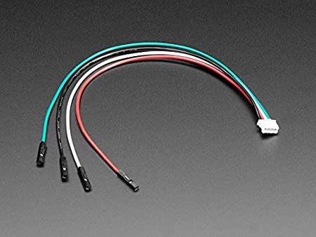
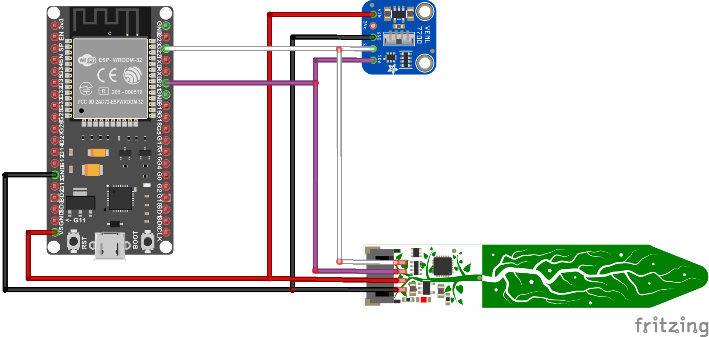

# Description 

This documentation describes which steps are required to put the prototype into operation. 

## Soil Moisture Sensor
For this sensor, you need a JST PH 4-Pin Connector to connect it to the ESP32.



## VEML7700 Brighntess Sensor
For this sensor, you have to solder a 5-pin-array to the PCB. After this, you can connect the sensor with jumper wire to the ESP32.

Examples of typical brightness levels in lux:

- at night: 0.5
- street lighting: 10
- living room: 50
- hall lighting: 100
- office room: 500
- overcast Himmel: 5000
- daylight: 10000
- bright sky: 20000

## Schematic

In the picture below you can see how the sensors are connected to the ESP32. The ESP32 itselfs needs a USB-B micro cable for connection to the PC.

- Red wires are +5V
- Black wires are GND
- Violett wires are SDA (GPIO 21)
- White wires are SCL (GPIO 22)



After connecting the sensors to the ESP, connect the ESP to the PC. You can now choose if you would use the Arduino IDE or PlatformIO in VSC. The source code is in **code** -> **vertical-prototype** -> **src** -> **main.cpp**.

## Arduino IDE

For the Arduino IDE, go to **Tools** -> **Boards** -> **ESP32 Arduino** and select the **ESP32 Dev Module**. If you haven't already set up the ESP32 board, this [Tutorial](https://randomnerdtutorials.com/installing-the-esp32-board-in-arduino-ide-windows-instructions/) shows how to do it. After that, select the right COM-port for the ESP32 and click the Upload button. Open the Serial Monitor and select the Baud rate to 115200. You should now see sensor values for temperature (C°), brightness (lx) and soil moisture (%).

## Platformio

For Platformio, go to **code** -> **vertical-prototype** and open the **platformio.ini** file. Now paste this code:

```
[env:esp32dev]
platform = espressif32
board = esp32dev
framework = arduino
	arduino-libraries/NTPClient@^3.1.0
	adafruit/Adafruit seesaw Library@^1.5.2
	adafruit/Adafruit VEML7700 Library@^1.1.1
	adafruit/Adafruit Unified Sensor@^1.1.4 
```

PlatformIO should automaticly select the right COM-port for the ESP32. After that, click on the **PlatformIO** symbol. You should now see a **esp32dev** folder wiht a drop down menu. Click **Build** to compile the Code. After successful compile click on **Upload** and the code will be uploaded to the ESP. On the right side of the Terminal, you can switch to the **Serial Monitor**. You should now see sensor values for temperature (C°), brightness (lx) and soil moisture (%).