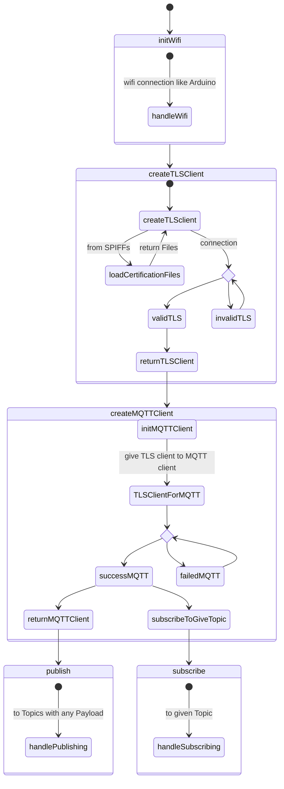

# AWS code structure 

In order to create a reusable vertical prototype a certain code-structure should be given. Therefore the AWS service handler functions are built up within an `AWS` class. 

## Symbolic state diagramm  

