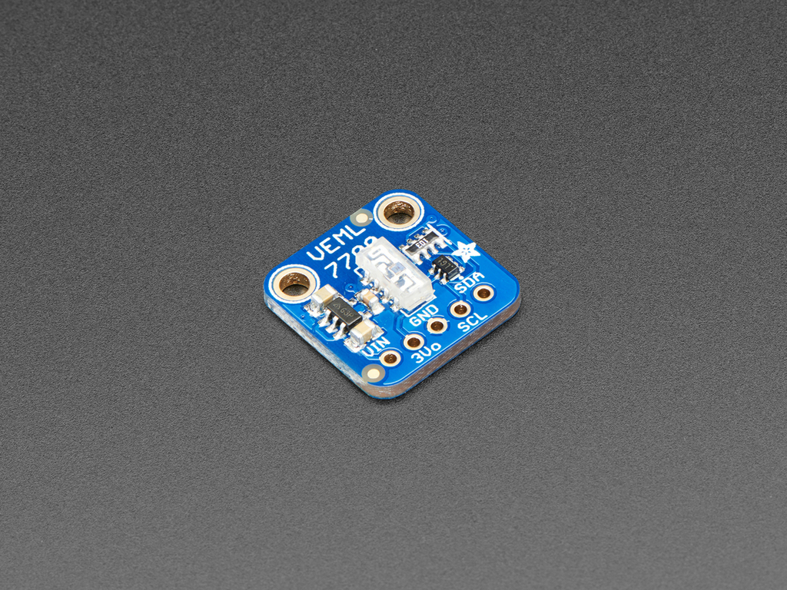

# Ambient Light Sensor Adafruit VEML7700

## VEML7700

- Ultra small Design
- Can be used with 3.3V or 5V logic level
- Cas used also with an Raspberry PI with Python
- Ambient light detection from 0 to 120 LUX with resoltion down to 0.0036 lx/ct
- No more than 1 Hz sampling rate (once every second)
- Body size: 16.5mm x 16.5mm x 2.1mm
- Got two mounting holes with a diameter of 2.5mm for M2.5 screws
- Communication Interface: I2C
- Includes an voltage regulator which provides 3.3V and 100mA
- 5 pins: Vin, GND, 3Vo(3.3V output), SCL, SDA
 > More information can be found [here](https://learn.adafruit.com/adafruit-veml7700)

## Picture from the PCB



## License for PCB Design

This PCB is Attribution-ShareAlike 3.0 Unported. This means it`s possible to copy and redistribute the material in any medium or format. Also it can be remix, transform, and build upon the material for any purpose, even commercially.

But, you must give appropriate credit, provide a link to the license, and indicate if changes were made. You may do so in any reasonable manner, but not in any way that suggests the licensor endorses you or your use. If you remix, transform, or build upon the material, you must distribute your contributions under the same license as the original.

> More informations for Attribution-ShareAlike 3.0 Unported see [here](https://creativecommons.org/licenses/by-sa/3.0/)

> PCB files are [here](https://github.com/adafruit/Adafruit-VEML7700-PCB)

## Library

- [Adafruit_VEML7700.h](https://github.com/adafruit/Adafruit_VEML7700/blob/master/Adafruit_VEML7700.h)

## Implementation

### Example Code

```
#include "Adafruit_VEML7700.h"

Adafruit_VEML7700 veml = Adafruit_VEML7700();

void setup() {
  while (!Serial) { delay(10); }
  Serial.begin(115200);
  Serial.println("Adafruit VEML7700 Test");

  if (!veml.begin()) {
    Serial.println("Sensor not found");
    while (1);
  }
  Serial.println("Sensor found");

  veml.setGain(VEML7700_GAIN_1);
  veml.setIntegrationTime(VEML7700_IT_800MS);

  Serial.print(F("Gain: "));
  switch (veml.getGain()) {
    case VEML7700_GAIN_1: Serial.println("1"); break;
    case VEML7700_GAIN_2: Serial.println("2"); break;
    case VEML7700_GAIN_1_4: Serial.println("1/4"); break;
    case VEML7700_GAIN_1_8: Serial.println("1/8"); break;
  }

  Serial.print(F("Integration Time (ms): "));
  switch (veml.getIntegrationTime()) {
    case VEML7700_IT_25MS: Serial.println("25"); break;
    case VEML7700_IT_50MS: Serial.println("50"); break;
    case VEML7700_IT_100MS: Serial.println("100"); break;
    case VEML7700_IT_200MS: Serial.println("200"); break;
    case VEML7700_IT_400MS: Serial.println("400"); break;
    case VEML7700_IT_800MS: Serial.println("800"); break;
  }

  //veml.powerSaveEnable(true);
  //veml.setPowerSaveMode(VEML7700_POWERSAVE_MODE4);

  veml.setLowThreshold(10000);
  veml.setHighThreshold(20000);
  veml.interruptEnable(true);
}

void loop() {
  Serial.print("Lux: "); Serial.println(veml.readLux());
  Serial.print("White: "); Serial.println(veml.readWhite());
  Serial.print("Raw ALS: "); Serial.println(veml.readALS());

  uint16_t irq = veml.interruptStatus();
  if (irq & VEML7700_INTERRUPT_LOW) {
    Serial.println("** Low threshold"); 
  }
  if (irq & VEML7700_INTERRUPT_HIGH) {
    Serial.println("** High threshold"); 
  }
  delay(500);
}
```