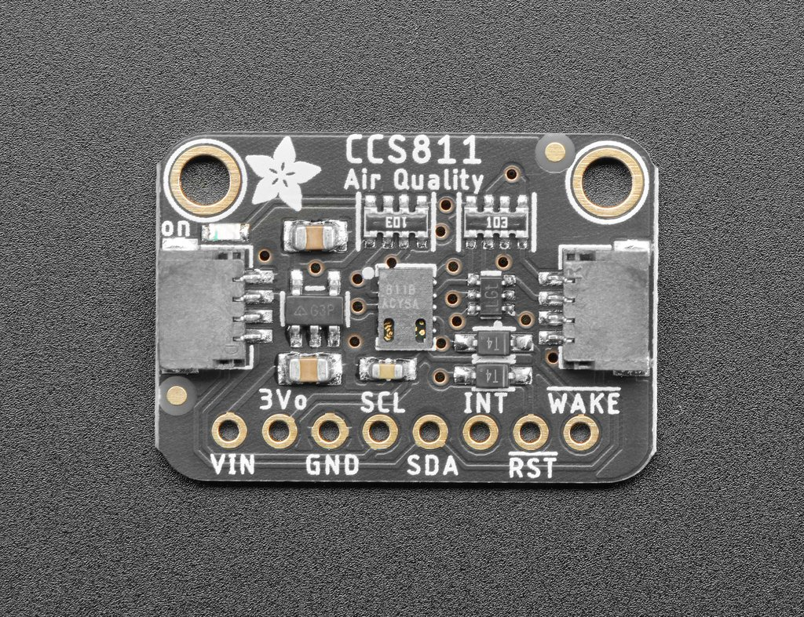
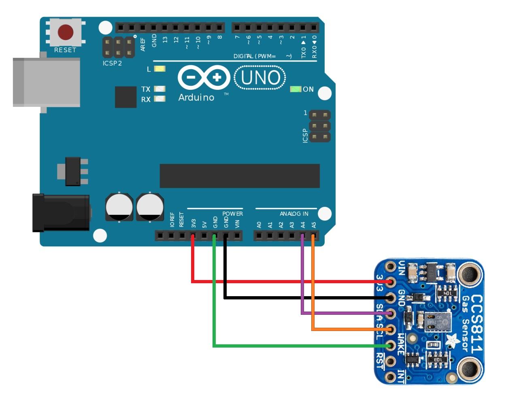

# Adafruit CCS811 CO2 sensor

## CCS811

- Ultra small Design
- Can be used with 3.3V or 5V logic level
- Can used also with an Raspberry PI with Python
- Can detect Alcohols, Aldehydes, Ketones, Organic Acids, Amines, Aliphatic and Aromatic Hydrocarbons
- Body size: 25.4mm x 17.8mm x 2.1mm
- Got two mounting holes with a diameter of 2.5mm for M2.5 screws
- Communication Interface: I2C
- It measures eCO2 within a range of 400 to 8192 ppm and TVOC withing a range of 0 to 1187 ppb
- Includes an voltage regulator which provides 3.3V and 100mA
- 3 power pins: Vin, GND and 3Vo(3.3V output),
- 3 logic pins: SCL, SDA and STEMMA QT
- 3 other pins: INT, WAKE and RST
- Can be connected with a STEMMA QT Connector
> More information can be found [here](https://learn.adafruit.com/adafruit-ccs811-air-quality-sensor?view=all)

## Picture of the sensor



## PCB Design
> The PCB Layout can be used for your own projects. Find more Informations [here](https://creativecommons.org/licenses/by-sa/3.0/)

> The PCB Files are [here](https://github.com/adafruit/Adafruit-CCS811-Breakout-PCB/tree/master)

## Libraries

- ["Adafruit_seesaw.h"](https://github.com/adafruit/Adafruit_CCS811)

## Implementation

### Example Code
```
#include "Adafruit_CCS811.h"

Adafruit_CCS811 ccs;

void setup() {
  Serial.begin(9600);

  Serial.println("CCS811 test");

  if(!ccs.begin()){
    Serial.println("Failed to start sensor! Please check your wiring.");
    while(1);
  }

  // Wait for the sensor to be ready
  while(!ccs.available());
}

void loop() {
  if(ccs.available()){
    if(!ccs.readData()){
      Serial.print("CO2: ");
      Serial.print(ccs.geteCO2());
      Serial.print("ppm, TVOC: ");
      Serial.println(ccs.getTVOC());
    }
    else{
      Serial.println("ERROR!");
      while(1);
    }
  }
  delay(500);
}
```
## How to connect the sensor on the Arduino

