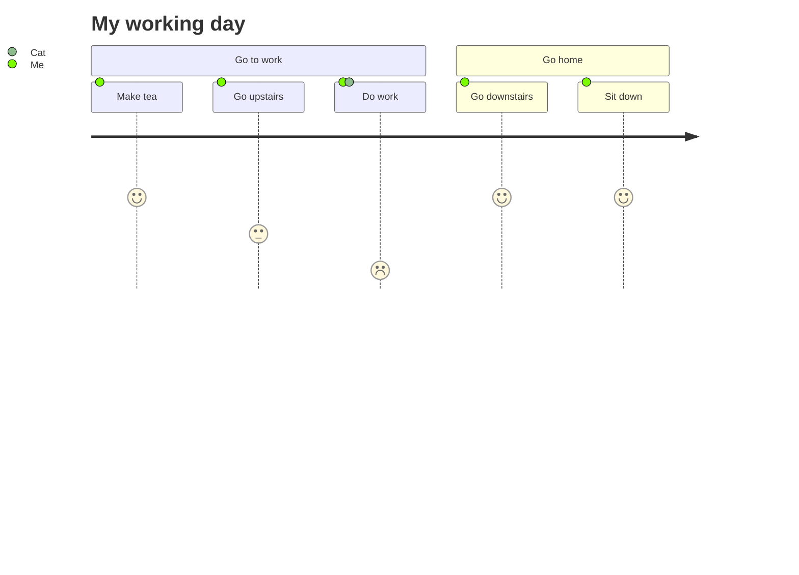

# Command Line Interface
The AWS CLI is an open source tool that enables the user to interact with AWS services using commands in the command-line shell. With the CLI basic functionality can be implemented and maintained. 

*Link* to the [docs](https://docs.aws.amazon.com/cli/latest/userguide/cli-chap-welcome.html)

The CLI can be used in the `Linux shell`, in the `Windows command line`and `Remotely`. There are different **AWS CLI** versions. The one used for *ECE IoT Prototyping* is Version `2.x`. 

## Installation 
The installations is described excellently in the *AWS DOCS*

`Linux` [installation](https://docs.aws.amazon.com/cli/latest/userguide/install-cliv2-linux.html)

`macOS` [installation](https://docs.aws.amazon.com/cli/latest/userguide/install-cliv2-mac.html)

`Windows` [installation](https://docs.aws.amazon.com/cli/latest/userguide/install-cliv2-windows.html)

---

!!! tip
    Have a look [here](https://www.w3schools.com/whatis/whatis_cli.asp) in order to understand what a CLI is!