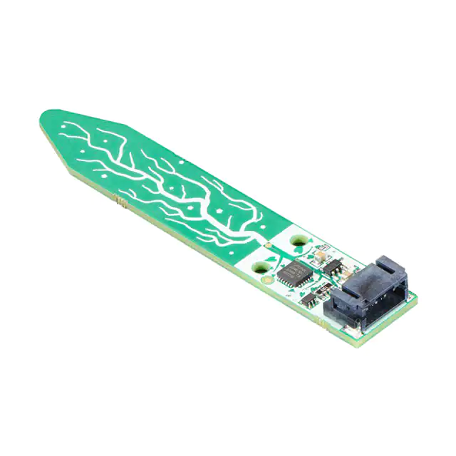
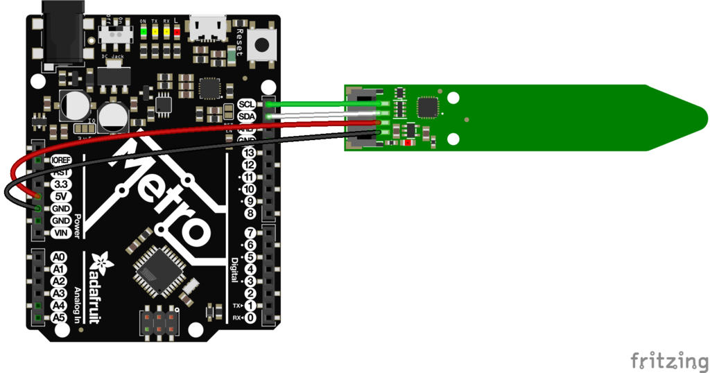

 Adafruit Soil/Moisture Sensor

## Soil Sensor

- Ultra small Design
- Can be used with 3.3V or 5V logic level
- Cas used also with an Raspberry PI with Python
- No more than 1 Hz sampling rate (once every second)
- Body size: 16.5mm x 16.5mm x 2.1mm
- Got two mounting holes with a diameter of 2.5mm for M2.5 screws
- Communication Interface: I2C
- Capacitive measurement
- provides a range from 200(very dry) to 2000(very wet)
- provides also the ambient temperature on the µC, but not with a high precision (+/-2°C)
- Includes an voltage regulator which provides 3.3V and 100mA
- 4 pins: Vin, GND, SCL, SDA
- Can be connected with a 4-pin JST-PH Connector
> More information can be found [here](https://learn.adafruit.com/adafruit-stemma-soil-sensor-i2c-capacitive-moisture-sensor)

## Picture of the sensor



## Libraries

- ["Adafruit_seesaw.h"](https://github.com/adafruit/Adafruit_Seesaw)

## Implementation

Include Library for this sensor:

```
#include "Adafruit_seesaw.h"
```

Generate a new object:

```
Adafruit_seesaw ss;
```

Set the baud rate and check if a sensor is connected to the board:

```
void setup() {
  Serial.begin(115200);
  Serial.println("seesaw Soil Sensor example!");
  
  if (!ss.begin(0x36)) {
    Serial.println("ERROR! seesaw not found");
    while(1);
  } else {
    Serial.print("seesaw started! version: ");
    Serial.println(ss.getVersion(), HEX);
  }
}
```
Now the soil humidity can be reading by using:
```
void loop() {
  float tempC = ss.getTemp();
  uint16_t capread = ss.touchRead(0);
```

The data will be printed on the Serial monitor:

```
  Serial.print("Temperature: "); Serial.print(tempC); Serial.println("*C");
  Serial.print("Capacitive: "); Serial.println(capread);
  delay(100);
}
```

## How to connect the sensor on the Arduino



#